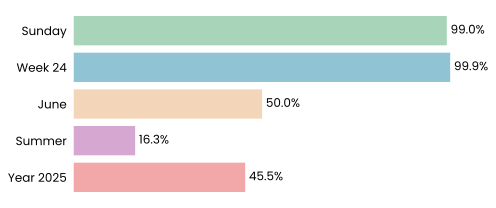

## obsidian-memo

Hi there! 👋 \
At first, this project was just a simple automatic backup of my Obsidian files using Bash and cron — but then I decided to experiment with different types of dynamic content and API integration. \
The following sections of this README are updated on a schedule and include AI-generated content. The same goes for commit messages, which are also generated automatically.

Weather API: [weatherapi.com](https://www.weatherapi.com/) \
LLM: [Gemini 2.5 Flash Preview 05-20](https://cloud.google.com/vertex-ai/generative-ai/docs/models/gemini/2-5-flash)

---
## time never waits

---
## weather outside
Weather in Moscow (2025-06-20, 14:00)

- 🌡️ Temperature: 12.1° (feels like 10.3°)
- 💨 Wind: northwestern breeze
- 💧 Humidity: 94%
- 🌦️ Condition: Light rain
- 📉 Pressure: 999 mb
- 🌞 UV index: soft UV 0.8
